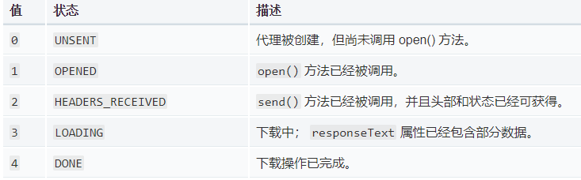

题目  
1.手动编写一个ajax，不依赖第三方库  
Ajax.html  
2.跨域的几种实现方式  
JSONP  
服务器端设置http header  

知识点  
XMLHttpRquest  
XMLHttpRequest 对象用于在后台与服务器交换数据  
```
var xhr = new XMLHttpRequest()
//true指使用异步 默认为异步
xhr.open("GET","/api",true)  

//在readystatechange事件上绑定一个函数
xhr.onreadystatechange = function(){
    //只要readyState属性发生变化，就会调用readystatechange事件上的事件处理函数onreadystatechange

    //readyState返回一个XMLHttpRequest代理当前所处的状态
    if(xhr.readyState == 4){ 
        //返回无符号短整型请求响应状态
        if(xhr.status == 20){
            //向ajax后台的程序发送XMLHttpRequest时, 后台程序接到请求会进行处理,处理结束后,返回一串数据给前台,这个就是responseText.
            alert(xhr.responseText)
        }
    }
}
//get方式发送请求send的参数为null
xhr.send(null)
```
async 参数指示请求使用应该异步地执行。如果这个参数是 false，请求是同步的，后续对 send() 的调用将阻塞，直到响应完全接收。  
如果这个参数是 true 或省略，请求是异步的，且通常需要一个 onreadystatechange 事件句柄。  

IE兼容性问题  
IE低版本使用ActiveXObject，和W3C标准不一样
***
状态码说明  
readyState属性 返回当前请求的状态


status  
2xx -表示成功处理请求。如200  
3xx -需要重定向，浏览器直接跳转  
4xx -客户端(request)请求错误，如404  
5xx -服务端(response)错误    

跨域  
什么是跨域  
  1.浏览器有同源策略，不允许ajax访问其他域接口  
&nbsp;&nbsp;&nbsp;本域脚本只能读写本域内的资源，而无法访问其它域的资源。这种安全限制称为同源策略。  
  2.跨域条件：协议、域名、端口(http协议默认80，https协议默认43)，有一个不同就算跨域。 

但是有3个标签允许跨域加载资源  
``  
``用于打点统计，统计网站可能是其他域  
`<link href=xxx>`  
`<link><script>`可以使用CDN，CDN的也是其他域  
`<script src=xxx>`   
`<script>`可以用于JSONP

跨域注意事项  
1.所有的跨域请求都必须经过信息提供方允许  
2.如果未经允许即可获取，那是浏览器同源策略出现漏洞  

JSONP  
JSONP实现原理  
1.加载http://coding.m.imooc.com/classindex.html  
2.不一定服务端(response)真正有一个classindex.html文件  
3.服务器可以根据请求，动态生成一个文件返回  
4.同理于`<script src="http://coding.m.imooc.com/api.js">`  

例如你的网站要访问慕课网的一个接口  
慕课给你一个地址`http://coding.m.imooc.com/api.js`  
返回内容格式如`callback({x:200,y:300})`（可动态生成）  
```
<script>
    window.callback = function(data){
        console.log(data)
    }
</script>
<script src=""http://coding.m.imooc.com/api.js></script>
//以上将返回{x:200,y:300}

那么在api.js文件中代码为：
callback({x:200,y:300})
```
