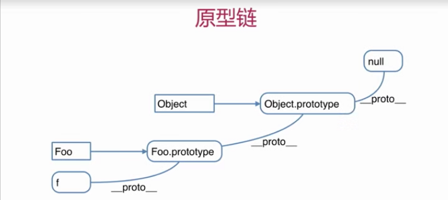

1.如何准确判断一个变量是数组类型 
```
var arr = []
arr instanceof Array //true
``` 
2.写一个原型链继承的例子
```
面试中不要这么写，以下帮助理解
//动物
function Animal(){
    this.eat = function(){
        console.log('animal eat')
    }
}
//狗
function Dog(){
    this.bark = function(){
        console.log('dog bark')
    }
}
Dog.prototype = new Animal()
var hashiqi = new Dog()
```  
在面试中可以用的例子：
```
写一个封装DOM查询的例子
function Elem(id){
    this.elem = document.getElementById('id')
}
Elem.prototype.html = function(val){
    var elem = this.elem
    if(val){
        elem.innerHTML = val
        return this
    }else{
        return elem.innerHTML
    }
}
Elem.prototype.on = function(type,fn){
    var elem = this.elem
    elem.addEventListener(type,fn)
}

var div1 = new Elem('div1')
console.log(div1.html())
//链式操作
div1.html('<p>Hello World</p>').on('click',funtion(){
    alert('clicked')
})
```
3.描述new一个对象的过程  
创建一个新对象 
this指向这个新对象  
执行代码，即对this赋值    
返回this

4.zepto（或其他框架）源码中如何使用原型链


知识点：  
构造函数  
```
function Foo(name,age){//构造函数函数名首字母大写
    this.name = name;
    this.age == age;
    this.class = 'class-1';
    //return this 默认这一行
}
var f = new Foo('tnsihy',21)
var f1 = new Foo('jgchen',22) //创建多个对象
```
构造函数-扩展  
var a = {}其实是var a = new Object()的语法糖  
var a = []其实是var a = new Date()的语法糖  
function Foo(){...}其实是var Foo = new Function(...)  
使用instanceof判断一个函数是否是一个变量的构造函数  
判断一个变量是否为“数组”：  
变量 instanceof Array

原型规则和示例  
1.所有的引用类型（对象、函数、数组），都具有对象特性，即可自由扩展属性（除了null以外） 
```
什么叫自由扩展属性：
var obj = {};
obj.a = 100;
var arr = [];
arr.a = 100;
function fn(){
    fn.a = 100;
}
``` 
2.所有的引用类型（对象、函数、数组），都有一个_proto_属性(隐式原型)，属性值是一个普通的对象
```
console.log(obj._proto_);
console.log(arr._proto_);
console.log(fn._proto_);
```
3.所有的函数都有一个prototype属性(显式原型)，属性值也是一个普通对象
`console.log(fn.prototype);`
4.所有的引用类型（对象、函数、数组），_proto_属性值指向它的构造函数的"prototype"属性值
`console.log(obj._proto_ === Object.prototype)`  
5.当试图得到一个引用类型的某个属性时，如果本身没有这个属性，那么会去它的_proto_属性（即它的构造函数prototype）中寻找。  
写在.html文件中  
原型链  

instanceof